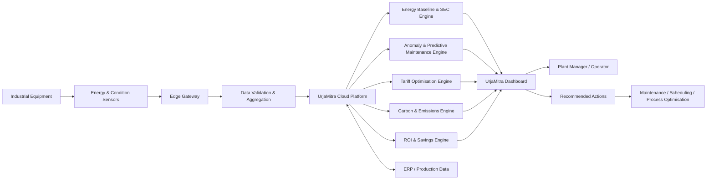

# ⚡ UrjaMitra

### Smart Energy Intelligence for Indian SMEs

> **Schneider Electric Hackathon — Smart Manufacturing: Industrial Energy & Process Efficiency**

UrjaMitra is a software prototype designed to help Indian small and medium-sized manufacturers reduce energy consumption, operating costs, and carbon emissions without compromising production throughput or product quality.

The platform combines **energy visibility, specific energy consumption (SEC) analysis, savings identification, predictive maintenance, tariff optimisation, carbon accounting, and ROI analysis** into one operator-friendly dashboard.

---

## 🎯 The Problem

Industry accounts for approximately **35–40% of India's total energy consumption**, while energy can represent **15–30% of production costs** for energy-intensive businesses.

Many SMEs still operate with:

- Ageing industrial equipment
- Limited or no real-time energy monitoring
- Manual process controls
- Poor visibility into equipment-level energy losses
- Unoptimised production scheduling
- Reactive rather than predictive maintenance
- Limited resources for carbon measurement and reporting

This creates a practical problem:

> **Factories may know that energy costs are high, but not exactly where energy is being wasted, why it is happening, or which intervention will produce the best financial return.**

UrjaMitra addresses this gap with an affordable, data-driven energy intelligence layer for the SME factory floor.

---

## 💡 Our Solution

UrjaMitra creates a digital energy baseline for a manufacturing plant and compares current/baseline behaviour with an optimised operating scenario.

The platform helps plant managers answer:

1. **Where is energy being consumed?**
2. **Where is energy being wasted?**
3. **Which intervention should we prioritise?**
4. **How much money and CO₂ can it save?**
5. **Is equipment showing early signs of failure?**
6. **When should flexible loads be scheduled?**
7. **What is the expected ROI and payback period?**

The prototype preserves production throughput while demonstrating how energy efficiency can be improved.

---

## 🚀 Key Features

### 1. Energy & Load Visibility

Visualises plant load over time and compares:

- Baseline consumption
- Optimised consumption
- Equipment-level consumption

The prototype models:

- Motors
- Furnace
- Compressor
- HVAC / lighting

---

### 2. Specific Energy Consumption (SEC)

UrjaMitra measures:

```text
SEC = Energy Consumption / Production Output
```

This makes it possible to evaluate energy efficiency without treating lower production as an efficiency improvement.

The prototype compares baseline and optimised SEC while keeping simulated throughput identical.

---

### 3. Savings Finder

The dashboard ranks energy-saving opportunities by financial impact.

Example interventions include:

- Furnace idle-hold optimisation
- Compressed-air leak reduction
- Motor maintenance
- HVAC and lighting scheduling

Each opportunity is translated into:

- Energy savings
- ₹ savings
- CO₂ impact
- Recommended action
- Implementation effort

---

### 4. Predictive Maintenance

UrjaMitra demonstrates condition monitoring using simulated:

- Motor current
- Vibration
- EWMA trend
- Statistical anomaly detection

The prototype identifies an early warning condition before a projected failure point, allowing maintenance to be scheduled proactively instead of waiting for equipment failure.

---

### 5. Tariff Optimisation

Energy-intensive flexible loads can be shifted away from expensive tariff periods.

The prototype estimates the financial benefit of moving a movable production/pre-heating load into lower-cost hours while respecting operating constraints.

---

### 6. Carbon Ledger

The dashboard estimates:

- Scope 2 emissions from grid electricity
- Scope 1 emissions from fuel
- Total emissions
- Emissions intensity per product unit

This provides a foundation for carbon transparency and future customer/buyer reporting requirements.

---

### 7. ROI & Payback Calculator

Factories can estimate:

- Annual energy bill
- Expected savings percentage
- Installation cost
- SaaS cost
- Annual savings
- Net savings after software cost
- Payback period

This helps translate energy efficiency from a technical problem into a business decision.

---

# 📊 Demonstrated Prototype Impact

Using the prototype's default synthetic scenario:

| Metric | Baseline | Optimised | Demonstrated Change |
|---|---:|---:|---:|
| Specific Energy Consumption | 1.69 kWh/unit | 1.39 kWh/unit | **17.7% reduction** |
| Monthly energy cost | — | — | **₹1,02,162 saved/month** |
| CO₂e avoided | — | — | **9.9 tCO₂e/month** |
| Production throughput | Same | Same | **Preserved** |

> These figures are generated from the prototype's synthetic simulation and are intended to demonstrate the methodology and potential impact. They are **not measurements from a real factory**.

---

# 🏗️ Proposed System Architecture

The current application is a software simulation. In a production deployment, UrjaMitra can operate as an energy-intelligence layer connected to industrial equipment.



### Proposed data flow

```text
Sensors
   ↓
Edge Gateway
   ↓
Energy + Equipment + Production Data
   ↓
Data Processing
   ↓
Baseline & Analytics
   ↓
Recommendations
   ↓
Operator Decision
   ↓
Energy / Maintenance / Scheduling Action
```

---

# 🔬 Technical Approach

## Baseline vs Optimised Model

The prototype creates two operating scenarios:

### Baseline

Represents the current operating condition, including:

- Equipment idle consumption
- Compressed-air losses
- Motor inefficiencies
- Unoccupied HVAC/lighting usage
- Furnace idle holding

### Optimised

Represents recommended operational improvements while maintaining the same production throughput.

The resulting difference is used to estimate:

```text
Energy Savings
Cost Savings
SEC Improvement
CO₂ Reduction
```

---

## Expected-Energy Model

The prototype demonstrates an expected-energy model:

```text
kWh = a + b × production + c × temperature
```

A healthy operating period is used as the reference to identify deviations between expected and observed energy behaviour.

This approach can be extended in a real deployment using historical plant data and additional process variables.

---

# 🏭 Target Users

UrjaMitra is designed initially for energy-intensive Indian SMEs such as:

- Foundries
- Textile mills
- Ceramics manufacturers
- Chemical processing units
- Food processing plants
- Brick kilns
- Small manufacturing facilities with significant motor, furnace, compressor, or HVAC loads

The platform is intended to be modular so that the monitoring and analytics layer can be adapted to different industrial processes.

---

# 💰 Deployment & Business Model

## Initial Deployment

A practical SME deployment can follow three stages:

### Stage 1 — Energy Audit & Baseline

Collect:

- Electricity consumption
- Production output
- Equipment operating schedules
- Temperature/process variables
- Fuel consumption

Establish the plant's baseline SEC.

### Stage 2 — Connected Monitoring

Install appropriate meters/sensors and an edge gateway to collect:

- Electrical parameters
- Equipment condition signals
- Production/process data

### Stage 3 — Continuous Optimisation

UrjaMitra continuously identifies:

- Energy losses
- Abnormal equipment behaviour
- Scheduling opportunities
- Maintenance opportunities
- Carbon reduction opportunities

---

## Business Model

UrjaMitra can use a hybrid model:

### Option A — Subscription

```text
One-time installation
+
Monthly SaaS subscription
```

### Option B — Shared Savings

For SMEs with limited upfront capital:

```text
₹0 / low upfront deployment
+
Percentage of verified energy savings
```

The prototype includes a shared-savings concept of **30% of verified savings for 24 months** as an illustrative commercial model.

Actual pricing would depend on plant size, number of monitored assets, sensor requirements, and deployment complexity.

---

# 📈 Scale-Up Roadmap

### Phase 1 — Prototype

- Synthetic factory simulation
- Energy analytics dashboard
- SEC calculation
- Savings identification
- Predictive maintenance demonstration
- Carbon accounting
- ROI calculator

### Phase 2 — Pilot SME

- Deploy energy meters and condition sensors
- Connect production data
- Establish real plant baseline
- Validate savings predictions
- Measure actual SEC improvement

### Phase 3 — Multi-Plant Platform

- Standardised industrial connectors
- ERP/MES integration
- Multi-site dashboards
- Fleet-level benchmarking
- Automated alerts
- Advanced predictive models

### Phase 4 — Industrial Energy Intelligence Platform

- AI-assisted optimisation
- Digital twins for selected processes
- Automated demand response
- Renewable-energy integration
- Battery/storage optimisation
- Continuous carbon intelligence

---

# 🖥️ Prototype

### Live Demo

The working Streamlit prototype demonstrates the complete analytics workflow:

**UrjaMitra — Smart Manufacturing Energy Dashboard**

The deployed prototype is available through Streamlit Community Cloud.

> **Note:** The prototype uses synthetic 30-day factory data. Real deployments would consume data from industrial energy meters, sensors, production systems, and/or ERP/MES integrations.

---

# 🛠️ Technology Stack

| Technology | Purpose |
|---|---|
| Python | Core application and analytics |
| Streamlit | Interactive web dashboard |
| NumPy | Numerical simulation |
| Pandas | Data processing and analysis |
| Plotly | Interactive visualisations |
| Git / GitHub | Version control and collaboration |
| Streamlit Community Cloud | Prototype deployment |

---

# 📂 Project Structure

```text
urjamitra/
│
├── app.py
├── requirements.txt
├── .gitignore
└── README.md
```

---

# ▶️ Run Locally

## 1. Clone the repository

```bash
git clone https://github.com/<your-username>/urjamitra.git
cd urjamitra
```

## 2. Create a virtual environment

```bash
python3 -m venv .venv
```

Activate it:

### Linux / WSL

```bash
source .venv/bin/activate
```

### Windows

```powershell
.venv\Scripts\activate
```

## 3. Install dependencies

```bash
pip install -r requirements.txt
```

## 4. Start the application

```bash
streamlit run app.py
```

The application will open in your browser.

---

# 🔐 Prototype & Data Disclaimer

UrjaMitra is a **hackathon prototype**.

The current dashboard uses **synthetically generated factory data** to demonstrate the proposed analytics, optimisation, predictive maintenance, carbon accounting, and ROI workflows.

The prototype does not claim to represent live industrial telemetry or guaranteed real-world savings.

Before production deployment:

- Sensor data must be validated.
- Energy baselines must be established from actual plant data.
- Emission factors should be updated using the appropriate current authoritative sources.
- Savings should be verified against actual production and energy measurements.
- Predictive-maintenance models should be trained and validated using equipment-specific historical data.

---

# 🌱 Why UrjaMitra?

The core idea is simple:

> **Make energy visible, make waste measurable, and make efficiency actionable.**

For Indian SMEs, decarbonisation cannot depend only on expensive infrastructure upgrades.

UrjaMitra focuses first on the information layer:

```text
Measure
   ↓
Understand
   ↓
Prioritise
   ↓
Act
   ↓
Verify
   ↓
Improve
```

By connecting energy consumption with production, equipment health, tariffs, carbon impact, and financial return, UrjaMitra aims to make energy efficiency a **continuous operational practice rather than a one-time energy audit**.

---

# 👥 Team

- **Ritvik R**
- **Gowtham V**
- **Kailesh S**

---

## ⚡ UrjaMitra

**Smart manufacturing. Lower energy intensity. Lower emissions. Stronger SMEs.**
